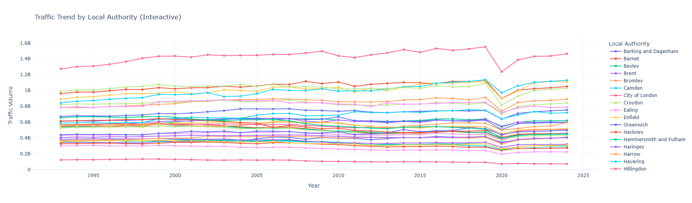
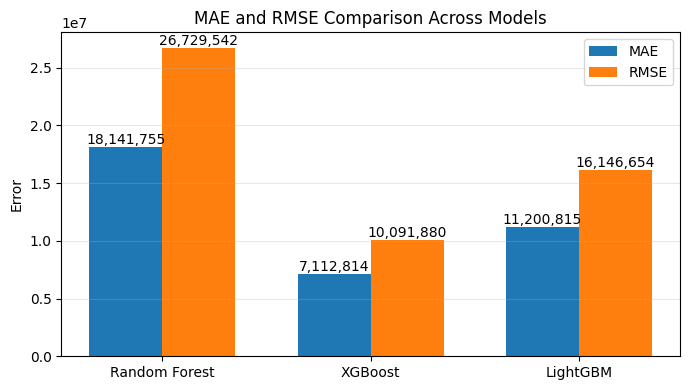
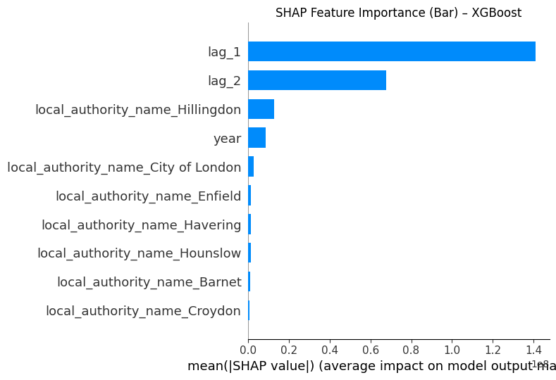
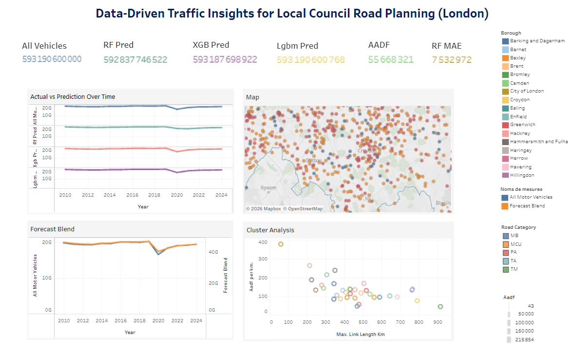

# London Traffic Analytics: Predictive Modelling & Geospatial Insights

### 1. Project Overview & Objective
This consultancy project analysed traffic patterns across London using Department for Transport (DfT) datasets. The objective was to move beyond historical reporting to build a predictive machine learning model for traffic volume forecasting, providing actionable insights for urban planning and congestion management.

* **Project Type:** Consultancy Group Project (4 Members)
* **Final Deliverable:** An interactive Tableau dashboard and executive presentation for transport stakeholders. 

### 2. My Contribution & Team Collaboration
While the overall predictive model and final presentations were a collaborative team effort, I specifically led the statistical hypothesis testing and explainable AI pipelines, while co-developing the geospatial architecture.

**My Specific Responsibilities:**
* **Data Engineering & Statistical Testing:** Led the traffic trend analysis and data cleaning. Formulated and tested core business hypotheses (H2 & H3) to mathematically prove post-2021 recovery trends and borough concentration.
* **Explainable AI (SHAP):** Independently applied SHAP (Shapley Additive exPlanations) to the team's machine learning model to extract "Glass Box" insights, translating complex XGBoost features into understandable business drivers.
* **Geospatial Engineering:** Co-developed a GeoPandas pipeline to process spatial datasets, mapping Average Annual Daily Flow (AADF) values to London boroughs via spatial joins.

### 3. Key Findings & Business Insights
* **The "Central London" Myth (Hypothesis 3):** We tested if the top 20% of boroughs accounted for >50% of traffic. The hypothesis was rejected: a Pareto-style analysis revealed the top 20% account for only **38.7%** of total traffic in 2024. This proves congestion is a widely dispersed, city-wide issue rather than being strictly centralised.
* **The COVID-19 Impact & Recovery (Hypothesis 2):** Time-series data validated a massive drop in traffic during the 2020 pandemic. By calculating the median post-2021 slope across 33 boroughs, I proved a positive, gradual recovery trend of **6.62 million vehicles/year**, which is critical for long-term transport revenue forecasting.

> ** 

* **Predictive Model Performance:** The team evaluated multiple models, with **XGBoost** heavily outperforming the others (achieving an R² of 0.999). 

> **

* **Key Traffic Drivers:** Using my SHAP analysis on the team's XGBoost model, we discovered that short-term historical traffic trends (1-year and 2-year lags) are the strongest predictors of future volume, followed closely by specific geographical markers like the borough of Hillingdon.

> **

### 4. Tech Stack & Data Sources
* **Analytics & Visualisation:** Tableau (Interactive Dashboard), Matplotlib
* **Machine Learning:** Python, Scikit-Learn, XGBoost, LightGBM, SHAP
* **Geospatial Processing:** GeoPandas
* **Data Sources:** DfT Local Authority Traffic Data, Major Road Database (MRDB), AADF

### 4. Dashboard
.**

